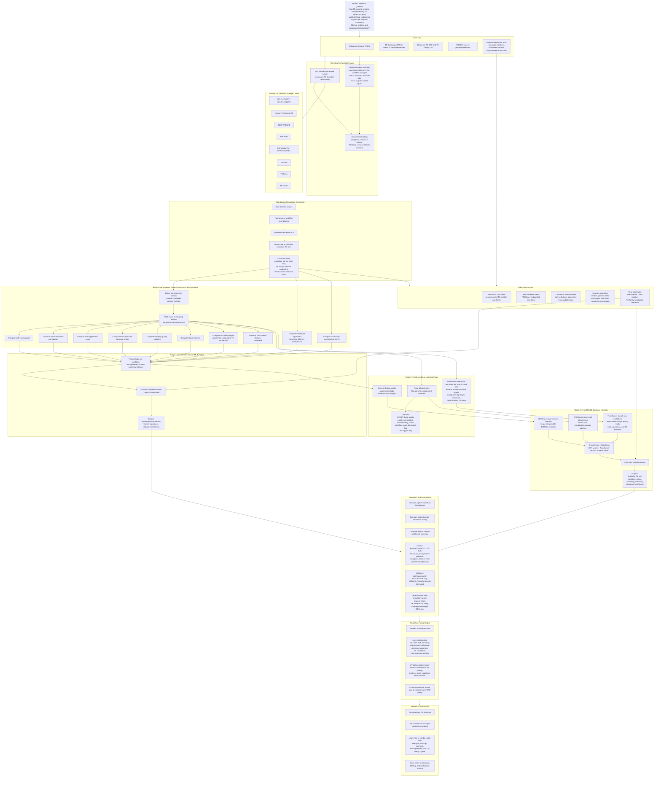

# Mermaid Architecture Diagrams

This README renders the four Mermaid `.mmd` architecture diagrams directly in GitHub.

## 1. Old McClintock Architecture

```mermaid

flowchart TD
    %% OLD / ORIGINAL McCLINTOCK-STYLE ARCHITECTURE
    %% Purpose: run multiple short-read TE insertion detectors, standardize outputs, compare predictions.

    A[Research Question:<br/>Where are transposable element insertions<br/>in a resequenced genome sample?]

    subgraph INPUTS[Input Data]
        B1[Reference Genome FASTA<br/>Example: sacCer2 yeast genome]
        B2[TE Consensus FASTA<br/>Known TE family sequences<br/>Example: Ty1, Ty2, Ty3, Ty4]
        B3[Reference TE Locations GFF<br/>Known TEs already present<br/>in the reference genome]
        B4[TE Family Mapping TSV<br/>Reference TE ID to TE family]
        B5[FASTQ Reads<br/>Short-read WGS sample<br/>single-end or paired-end]
    end

    A --> INPUTS

    subgraph PREP[Preprocessing and Setup]
        C1[Check Input Files<br/>valid contig names, TE IDs, family IDs]
        C2[If GFF/TSV not supplied:<br/>Run RepeatMasker to create<br/>reference TE locations and taxonomy]
        C3[Optional TrimGalore/FastQC<br/>adapter trimming and read QC]
        C4[Prepare method-specific input files<br/>because each TE detector expects<br/>different formats]
    end

    INPUTS --> C1 --> C2 --> C3 --> C4

    subgraph ALIGN[Read Alignment Layer]
        D1[Map reads to reference genome<br/>using aligner required by methods]
        D2[Create SAM/BAM alignment files]
        D3[Extract mapping statistics:<br/>read length, insert size,<br/>coverage, mapped read counts]
    end

    C4 --> D1 --> D2 --> D3

    subgraph EVIDENCE[Biological Evidence in BAM]
        E1[Split-read evidence<br/>read crosses genome-TE breakpoint<br/>high positional accuracy]
        E2[Read-pair evidence<br/>one mate near breakpoint,<br/>other mate maps unexpectedly/TE-like<br/>higher sensitivity]
        E3[Soft-clipped reads<br/>part of read maps, part does not]
        E4[Read depth / coverage<br/>supports TE copy-number or abundance]
        E5[Target-site duplication clues<br/>short duplicated sequence near insertion]
    end

    D2 --> EVIDENCE

    subgraph METHODS[Component TE Detection Methods]
        F1[ngs_te_mapper]
        F2[ngs_te_mapper2]
        F3[PoPoolationTE]
        F4[PoPoolationTE2]
        F5[RelocaTE]
        F6[RelocaTE2]
        F7[RetroSeq]
        F8[TEBreak]
        F9[TEFLoN]
        F10[TE-locate]
        F11[TEMP]
        F12[TEMP2]
        F13[Coverage Module<br/>normalized TE coverage plots<br/>and TE depth summaries]
    end

    EVIDENCE --> METHODS

    subgraph RAWOUT[Raw Method Outputs]
        G1[Raw BED/GFF/VCF/table files<br/>method-specific coordinates<br/>method-specific support values]
        G2[Reference TE predictions<br/>if supported by method]
        G3[Non-reference TE predictions<br/>new sample-specific insertions]
        G4[Different coordinate conventions<br/>0-based vs 1-based,<br/>single point vs interval,<br/>TSD vs breakpoint]
    end

    METHODS --> RAWOUT

    subgraph POST[Post-processing and Standardization]
        H1[Apply method-specific filters<br/>support thresholds, frequency thresholds,<br/>both-end support, breakpoint confidence]
        H2[Convert coordinates<br/>to standardized 0-based BED intervals]
        H3[Create standardized VCF<br/>for non-reference TE calls]
        H4[Mark prediction type:<br/>reference or non-reference]
        H5[Attach TE family and method name]
        H6[Remove redundant predictions<br/>within each method]
    end

    RAWOUT --> H1 --> H2 --> H3 --> H4 --> H5 --> H6

    subgraph SUMMARY[Summary and Comparison]
        I1[Summary table by method:<br/>ALL, REFERENCE, NON-REFERENCE]
        I2[Summary table by TE family:<br/>Ty1, Ty2, Ty3, Ty4, etc.]
        I3[Prediction pages by contig/chromosome]
        I4[Coverage reports for TE families]
        I5[Interactive HTML report<br/>run command, QC, mapping stats,<br/>method predictions]
    end

    H6 --> SUMMARY

    subgraph EVALUATION[Paper Evaluation Design]
        J1[Simulated yeast genomes<br/>insert one artificial TE at known location]
        J2[Simulate WGS reads with known truth]
        J3[Run McClintock]
        J4[Evaluate detection:<br/>exact TSD, within 100 bp,<br/>within 300 bp, within 500 bp]
        J5[Real yeast WGS strains]
        J6[Check biological validity:<br/>Ty insertions near tRNA genes,<br/>TE family activity,<br/>target-site duplication patterns]
    end

    SUMMARY --> EVALUATION

    subgraph MAIN_FINDINGS[Main Findings / Meaning]
        K1[No single TE detector is best<br/>for all cases]
        K2[Split-read methods:<br/>fewer calls but more precise breakpoints]
        K3[Read-pair methods:<br/>more sensitive but less precise]
        K4[Combining methods improves coverage<br/>of biologically realistic insertions]
        K5[McClintock lowers the barrier<br/>to running and comparing TE detectors]
    end

    EVALUATION --> MAIN_FINDINGS

```

## 2. Improved ML McClintock Architecture

## 3. Old 2008 Biological Text Mining Architecture

```mermaid

flowchart TD
    %% OLD / 2008 BIOLOGICAL TEXT-MINING ARCHITECTURE
    %% Purpose: make biological literature more accessible by extracting entities, facts, and evidence and linking them to databases/curation.

    A[Core 2008 Problem:<br/>Biological knowledge is locked in papers.<br/>Manual curation is slow and expensive.<br/>How can text mining connect literature to databases?]

    subgraph SOURCES[Information Sources]
        B1[PubMed titles and abstracts]
        B2[Full-text articles when available]
        B3[Biological databases:<br/>UniProt, MGI, OMIM, IntAct, etc.]
        B4[Controlled vocabularies and ontologies:<br/>Gene Ontology, MeSH, UMLS]
        B5[Human curators and domain experts]
    end

    A --> SOURCES

    subgraph ACCESS[Document Access and Preprocessing]
        C1[Collect relevant papers]
        C2[Convert documents to processable text<br/>HTML/PDF/XML to text]
        C3[Split into title, abstract,<br/>sections, paragraphs, sentences]
        C4[Tokenization and sentence processing]
        C5[Document metadata:<br/>PMID, DOI, authors, year, journal]
    end

    SOURCES --> C1 --> C2 --> C3 --> C4 --> C5

    subgraph NER[Named Entity Recognition]
        D1[Detect gene/protein mentions]
        D2[Detect chemicals, diseases,<br/>species, phenotypes as future expansion]
        D3[Use dictionaries, lexicons,<br/>rules, CRFs/SVMs or early ML]
        D4[Output:<br/>text span + entity type]
    end

    C4 --> NER

    subgraph NORMALIZE[Entity Normalization / Database Linking]
        E1[Resolve synonyms and ambiguous names]
        E2[Map mentions to database IDs:<br/>Entrez Gene, UniProt, GO, MeSH, UMLS]
        E3[Example:<br/>BRCA1, breast cancer 1, BRCC1<br/>all map to one gene ID]
        E4[Output:<br/>entity mention + normalized ID]
    end

    NER --> NORMALIZE

    subgraph RELATIONS[Relation and Fact Extraction]
        F1[Detect protein-protein interactions]
        F2[Detect gene-protein links]
        F3[Detect gene-disease or genotype-phenotype links<br/>as future challenge]
        F4[Extract simple facts:<br/>A interacts with B,<br/>A is located in B,<br/>A is associated with B]
        F5[Early approaches:<br/>co-occurrence, patterns,<br/>dependency parsing,<br/>supervised classifiers]
    end

    NORMALIZE --> RELATIONS

    subgraph EVIDENCE[Evidence Linking]
        G1[Link extracted fact back to<br/>supporting sentence or passage]
        G2[Record paper ID and location]
        G3[Distinguish known, novel,<br/>uncertain, or conflicting findings<br/>as a desired future direction]
        G4[Help curators inspect source evidence]
    end

    RELATIONS --> EVIDENCE

    subgraph DATABASES[Database / Ontology Integration]
        H1[Add links from literature to databases]
        H2[Attach extracted facts to<br/>curated biological records]
        H3[Use controlled vocabularies<br/>to make facts computable]
        H4[Support structured digital abstracts<br/>and metadata-rich publications]
    end

    EVIDENCE --> DATABASES

    subgraph CURATION[Human Curation Workflow]
        I1[Curators receive suggested papers]
        I2[Curators inspect highlighted entities<br/>and evidence sentences]
        I3[Curators accept/reject/edit annotations]
        I4[Corrections improve databases<br/>and can create training data]
    end

    DATABASES --> CURATION

    subgraph INTERFACE[User Interfaces and Applications]
        J1[Computer-assisted reading tools]
        J2[Search systems that return<br/>papers, passages, sentences, or facts]
        J3[Database record pages with<br/>literature evidence links]
        J4[Automatic summaries and reports<br/>as future direction]
        J5[Question answering<br/>as future direction]
    end

    CURATION --> INTERFACE

    subgraph EVALUATION[BioCreative / Challenge Evaluation]
        K1[Define benchmark tasks]
        K2[Create gold-standard corpora]
        K3[Evaluate gene mention recognition]
        K4[Evaluate gene normalization]
        K5[Evaluate protein-protein interactions]
        K6[Compare systems using precision,<br/>recall, F1]
        K7[Encourage collaboration between<br/>tool developers and biological users]
    end

    INTERFACE --> EVALUATION

    subgraph MAIN_IDEA[Main 2008 Vision]
        L1[Text mining should not be isolated]
        L2[It should be embedded in<br/>larger biological workflows]
        L3[Publications, databases, curators,<br/>and users should be connected]
        L4[Goal:<br/>turn free-text literature into<br/>computable biological knowledge]
    end

    EVALUATION --> MAIN_IDEA

```

## 4. Modern Biomedical Text Mining + GraphRAG Architecture

```mermaid

flowchart TD
    %% MODERN VERSION OF THE 2008 BIOLOGICAL TEXT-MINING VISION
    %% Purpose: evidence-aware biomedical literature mining + ontology-grounded knowledge graph + GraphRAG + curator feedback.

    A[Modern Research Question:<br/>Can we turn biomedical literature into<br/>evidence-grounded, ontology-linked,<br/>searchable knowledge while reducing hallucination<br/>and supporting human curation?]

    subgraph DATA[Data Sources]
        B1[PubMed abstracts]
        B2[PubMed Central full text]
        B3[PDF papers]
        B4[Supplementary files]
        B5[Tables and figure captions]
        B6[Biological databases:<br/>UniProt, NCBI Gene, OMIM, IntAct]
        B7[Ontologies/vocabularies:<br/>UMLS, MeSH, Gene Ontology, HGNC]
    end

    A --> DATA

    subgraph INGEST[Data Ingestion and Versioning]
        C1[Download or collect documents]
        C2[Store raw files]
        C3[Record metadata:<br/>PMID, DOI, year, journal, authors]
        C4[Version control corpus and ontology releases]
        C5[Create document IDs and sentence IDs]
    end

    DATA --> C1 --> C2 --> C3 --> C4 --> C5

    subgraph DOCAI[Document AI Parsing]
        D1[Parse XML/HTML directly when available]
        D2[Parse PDFs with GROBID/PyMuPDF-like tools]
        D3[Extract structure:<br/>title, abstract, introduction,<br/>methods, results, discussion]
        D4[Extract tables]
        D5[Extract figure captions]
        D6[Remove references/bibliography noise<br/>or mark it separately]
    end

    INGEST --> DOCAI

    subgraph PREPROCESS[Section-aware Preprocessing]
        E1[Sentence splitting]
        E2[Tokenization]
        E3[Abbreviation detection<br/>example: tumor necrosis factor alpha = TNF-alpha]
        E4[Section label attached to every sentence]
        E5[Chunk creation for retrieval<br/>sentence, paragraph, section chunks]
        E6[Metadata attached to chunks:<br/>paper ID, section, sentence ID, table/caption ID]
    end

    DOCAI --> PREPROCESS

    subgraph EXTRACT[Biomedical Extraction Models]
        F1[Named Entity Recognition<br/>PubMedBERT/BioBERT token classifier]
        F2[Entity types:<br/>gene, protein, disease, drug,<br/>mutation, phenotype, pathway,<br/>species, cell type, method]
        F3[Entity Linking / Normalization<br/>map mentions to UMLS, MeSH,<br/>NCBI Gene, UniProt, GO, HGNC]
        F4[Relation Extraction<br/>A interacts with B,<br/>drug treats disease,<br/>mutation associated with phenotype]
        F5[Event Extraction<br/>trigger + agent + target + condition + method]
        F6[Negation Detection<br/>not/no/failed to]
        F7[Speculation Detection<br/>may/might/suggests/possible]
        F8[Evidence Classification<br/>experimental result, method,<br/>background, review, speculative,<br/>negative result]
    end

    PREPROCESS --> EXTRACT

    subgraph QUALITY[Ontology-Grounded Validation and Cleaning]
        G1[Schema constraints:<br/>Drug treats Disease is valid;<br/>Disease phosphorylates Protein is invalid]
        G2[Duplicate merging:<br/>same entity/relation from multiple papers]
        G3[Conflict detection:<br/>one paper supports, another negates]
        G4[Confidence calibration:<br/>model probability becomes usable confidence]
        G5[Evidence provenance check:<br/>every fact must link to source sentence/table/caption]
    end

    EXTRACT --> QUALITY

    subgraph GRAPH[Evidence-aware Knowledge Graph]
        H1[Nodes:<br/>Gene, Protein, Disease, Drug,<br/>Mutation, Species, Pathway,<br/>Paper, Sentence, Method]
        H2[Edges:<br/>INTERACTS_WITH, INHIBITS,<br/>ACTIVATES, CAUSES, TREATS,<br/>ASSOCIATED_WITH, MENTIONED_IN,<br/>SUPPORTED_BY]
        H3[Every edge stores:<br/>source sentence, paper ID, section,<br/>evidence type, confidence,<br/>negation/speculation status]
        H4[Storage options:<br/>Neo4j property graph or RDF/SPARQL]
    end

    QUALITY --> GRAPH

    subgraph RETRIEVE[Hybrid Retrieval Layer]
        I1[BM25 keyword search<br/>good for exact names like BRCA1, EGFR, rpoB]
        I2[Dense vector search<br/>semantic similarity over chunks]
        I3[Graph retrieval<br/>neighbors, paths, relation queries]
        I4[Ontology expansion<br/>synonyms and database IDs improve recall]
        I5[Cross-encoder reranker<br/>query + passage/fact relevance scoring]
        I6[Final evidence bundle:<br/>text chunks + graph facts + source sentences]
    end

    GRAPH --> RETRIEVE
    PREPROCESS --> RETRIEVE

    subgraph GRAPRAG[GraphRAG / Biomedical QA]
        J1[User asks question:<br/>What genes interact with BRCA1 in DNA repair?]
        J2[Question analysis:<br/>detect entities, intent, relation type]
        J3[Retrieve graph facts and paper passages]
        J4[Filter by evidence quality:<br/>prefer Results/experimental evidence,<br/>avoid unsupported speculation]
        J5[LLM generates answer using retrieved evidence only]
        J6[Answer includes citations/evidence:<br/>source sentence, paper ID, confidence]
    end

    RETRIEVE --> GRAPRAG

    subgraph VERIFY[Hallucination and Citation Checking]
        K1[Claim extraction from generated answer]
        K2[Check every claim against retrieved evidence]
        K3[Check citation support:<br/>does cited sentence actually support claim?]
        K4[Flag unsupported claims]
        K5[Uncertainty-aware response:<br/>strong evidence, weak evidence,<br/>conflicting evidence, no evidence found]
    end

    GRAPRAG --> VERIFY

    subgraph CURATOR[Curator Dashboard]
        L1[Display original sentence/table/caption]
        L2[Show extracted entities and normalized IDs]
        L3[Show proposed relations/events]
        L4[Show evidence type, confidence,<br/>negation/speculation flags]
        L5[Human actions:<br/>accept, reject, edit relation,<br/>fix entity ID, mark uncertain]
    end

    VERIFY --> CURATOR

    subgraph ACTIVE[Active Learning Feedback Loop]
        M1[Select uncertain/high-impact predictions]
        M2[Send to curator first]
        M3[Save human corrections]
        M4[Retrain/fine-tune NER, linker,<br/>relation, event, evidence models]
        M5[Improve future extraction and QA]
    end

    CURATOR --> ACTIVE
    ACTIVE --> EXTRACT

    subgraph EVAL[Evaluation Layer]
        N1[NER F1]
        N2[Entity linking accuracy]
        N3[Relation/event extraction F1]
        N4[Evidence classification F1]
        N5[Retrieval metrics:<br/>Recall@K, MRR, nDCG]
        N6[Graph quality:<br/>valid edges, duplicate rate,<br/>evidence coverage]
        N7[QA quality:<br/>answer correctness, citation accuracy,<br/>hallucination rate, faithfulness]
        N8[Human workflow:<br/>curator time saved,<br/>correction rate, agreement]
    end

    VERIFY --> EVAL
    ACTIVE --> EVAL

    subgraph CONTRIBUTION[Modern Research Contribution]
        O1[2008 vision:<br/>connect literature, databases, curators, users]
        O2[Modern upgrade:<br/>biomedical Transformers + LLMs]
        O3[Evidence-aware knowledge graph]
        O4[GraphRAG with citation checking]
        O5[Human-in-the-loop curation and active learning]
        O6[System-level evaluation beyond simple F1]
    end

    EVAL --> CONTRIBUTION

```

